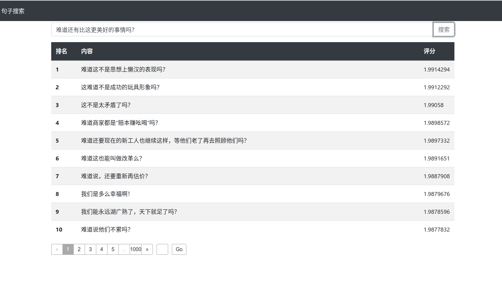
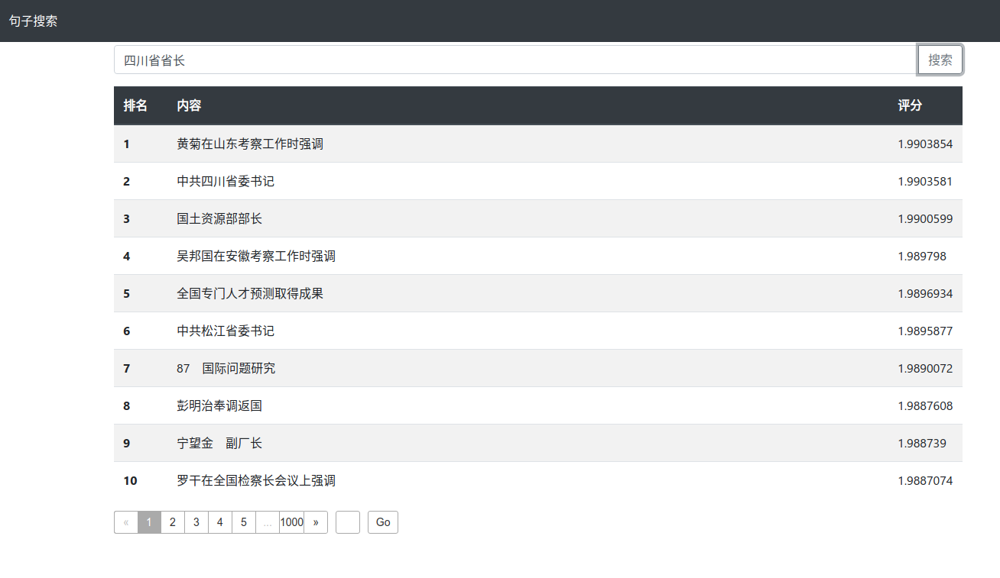
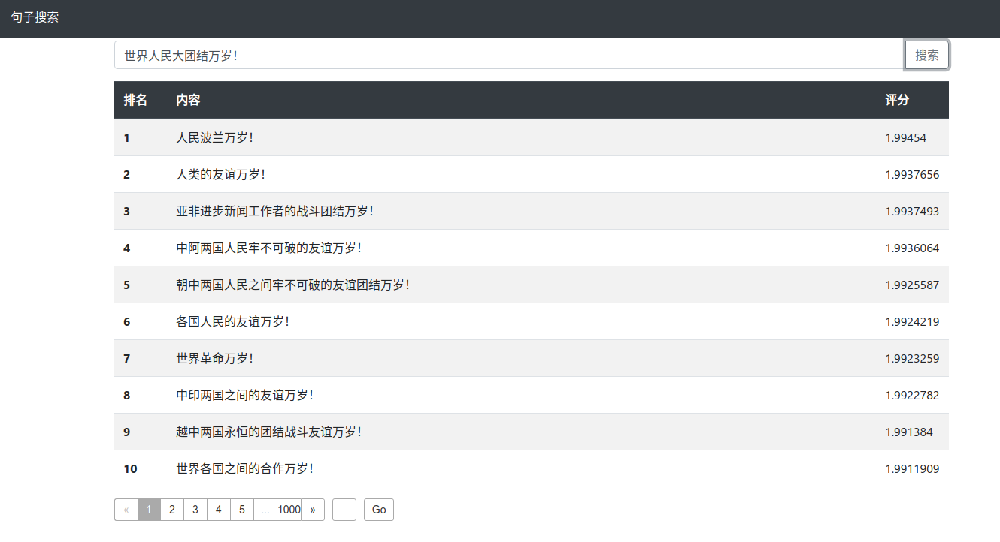

[toc]

# IR-system

信息检索课程第三次及第五次作业。

## 部署 Elasticsearch

适用 Ubuntu 20.04 操作系统。

安装好 Elasticsearch 后，启动服务：

```shell
sudo /bin/systemctl daemon-reload
sudo /bin/systemctl enable elasticsearch.service
sudo systemctl start elasticsearch.service
```

## 启动 web 应用

```shell
cd web
npm install express body-parser @elastic/elasticsearch
node app
```

然后访问 http://localhost:8080 即可使用系统。页面简明易用。

## 词语检索

### 分词及词性标注

基于 THULAC 进行分词和词性标注，代码已经整合到本项目中。将人民日报语料文件 `rmrb1946-2003-delrepeat.all` 放在项目目录下，进行分词并生成适用于 Elasticsearch Bulk API 的文件至 `docs.json` 的命令是：

```shell
cd cut
make
./thulac -input ../rmrb1946-2003-delrepeat.all -output docs.json 
```

### 创建索引

索引的配置在 `index-config.json` 中，创建新索引的命令为：

```shell
curl -X DELETE "localhost:9200/docs?pretty"
curl -X PUT "localhost:9200/docs?pretty" -H 'Content-Type: application/json' --data-binary "@index-config.json"
```

运行 python 脚本上传经过分词处理的文档。

```shell
cd cut
pip install elasticsearch
python index.py
```

## 相似句子检索

第五次作业在原有系统基础上实现了相似句子检索功能，实现算法为对文档集中的每个文档使用 transformer 计算其文档表示，对于每个查询对其用同样方法计算其表示，再计算其与文档集中的文档的余弦相似度。系统使用了一种[中文 BERT](https://github.com/ymcui/MacBERT) 来计算文档表示。

下图的结果可以看出，当输入为反问句时，能检索出很多反问句。



下图结果可以看出，当输入为`四川省省长`和`美国总统访华`时，输出了很多相似结构的短语或句子：






