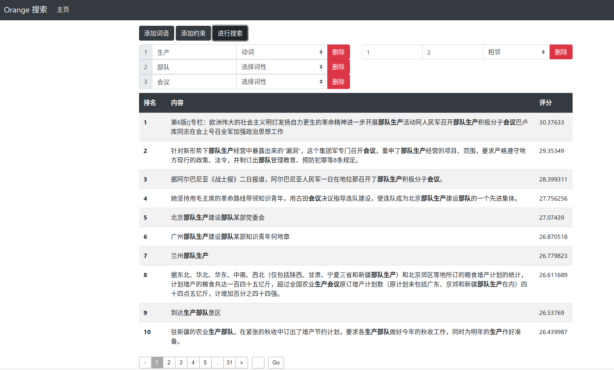

# 信息检索第三次作业报告

> 罗崚骁 计75
>
> 2017011364

## 摘要

本次作业搭建了一个简单的信息检索系统。系统支持：输入若干词语及其词性（可以只输入词语或词性），并可对输入的词语进行位置约束的限制，寻找相关的文档并显示结果。

本次作业的工作主要分为先后以下几项：

1. 下载人民日报数据作为系统检索文档集；
2. 使用 THULAC 工具，使用其提供 demo 的基础上对所有文档分词并进行词性标注，保存分词和词性标注结果；
3. 使用 Elasticsearch 作为系统搜索引擎实现，在 Ubuntu20.04 计算机上部署；
4. 使用 Elasticsearch 提供的相关接口创建索引，并将分词结果作为文档上传索引；
5. 开发检索系统的 web 应用， 使能够通过浏览器使用检索系统。

## 分词与词性标注

使用 [THULAC](https://github.com/thunlp/THULAC) 工具（C++）版进行分词和词性标注。实现时为了便利，引用了[一个 C++ 的 json 库](https://github.com/nlohmann/json) 和[一个 C++ 的进度条库](https://github.com/p-ranav/indicators)，并对 THULAC 的源代码进行了微小的修改使其可以输出用于 Elasticsearch Bulk API 的文件。文档经过分词和词性标注后，首先将词语与其对应词性以下划线 `_` 连接，随后再将这些结果用空格拼接为一个完成的句子。

## 部署 Elasticsearch

作业在 Ubuntu 20.04 操作系统上完成，参照[官方给出的基于 `deb` 包的方法](https://www.elastic.co/guide/en/elasticsearch/reference/current/deb.html)安装了 Elasticsearch 最新版（7.10.0），安装好后即通过如下命令创建并启动 Elasticsearch 服务：

```shell
sudo /bin/systemctl daemon-reload
sudo /bin/systemctl enable elasticsearch.service
sudo systemctl start elasticsearch.service
```

于是便有一个 Elasticsearch 结点在本机 9200 端口上工作。

## 创建索引

创建的索引只有 `content` 这一属性，类型为 `text`。为了支持词语或词性不同的匹配方法，使用了 Elasticsearch 的 `pattern capture token filter` ，其作用为：输入一个 token，可根据相关规则输出**多个** token，并且新的 token 和输入 token 的位置**信息相同**。于是，对于已经经过空格分隔得到若干 token（形如 `词语_词性`），可以通过编写相关规则除了使其输出自身外，还输出 `词语`，`词性` 两个新 token，由此便能实现通过词语或词性进行检索的目的。

由于 Elasticsearch 的 Bulk API 能上传的文件大小上限为 100M，而分词后的文件达 3G，无法直接使用 CLI，于是使用 Elasticsearch 的 python API 将文档集分批上传，分伺后在 `cut` 目录下执行 `index.py` 脚本即可。

## 搜索

搜索的输入为若干单词及其词性（单词内容及词性都为可选，但至少有其一），以及这些词语之间的一些位置约束。

对于输入的单词及相关词性，仍然是先将单词及词性用下划线连接，再将这些结果以空格分隔形成一个完整的字符串，最后使用 Elasticsearch 的 `match` 查询方法查询。值得注意的是，搜索过程中 token 不能和建索引时作相同的处理，否则本来较严的搜索条件会便宽。例如，如果查询 `吃_v` 时如果使用相同的处理方式，则会得到 `吃_v`，`吃`，`v` 三种 token，可能会错误地匹配上其它词语。

对于位置约束，以左相邻为例，只需将两个词语用空格分隔，再使用 [match_phrase](https://www.elastic.co/guide/en/elasticsearch/reference/current/query-dsl-match-query-phrase.html) 方法即可。由于 `match_phrase` 方法会要求以相同顺序匹配到查询串中的所有词语，因此可以以此实现相邻的位置约束；若为不左邻，则将查询从 `must` 中放入 `must_not` 中；对于右邻，即为将两个 token 位置交换的左邻；对于相邻，即要么左邻要么右邻，只需要将左邻和右邻的查询用一个 `should` 包含即可。

## web 应用

基于 Node.js 的 express 框架搭建系统后端，后端处理前端传来的搜索请求，包含词语以及相关约束，生成查询并调用 Elasticsearch API，再将查询结果发送给前端。

前端页面主要包含输入词语、约束以及结果展示三个板块。用户可以添加或删除词语和约束，选择词语的词性，约束的类型，点击搜索按钮后前端将搜索请求发至后端，收到结果后分页展示。

应用页面示例如下：

