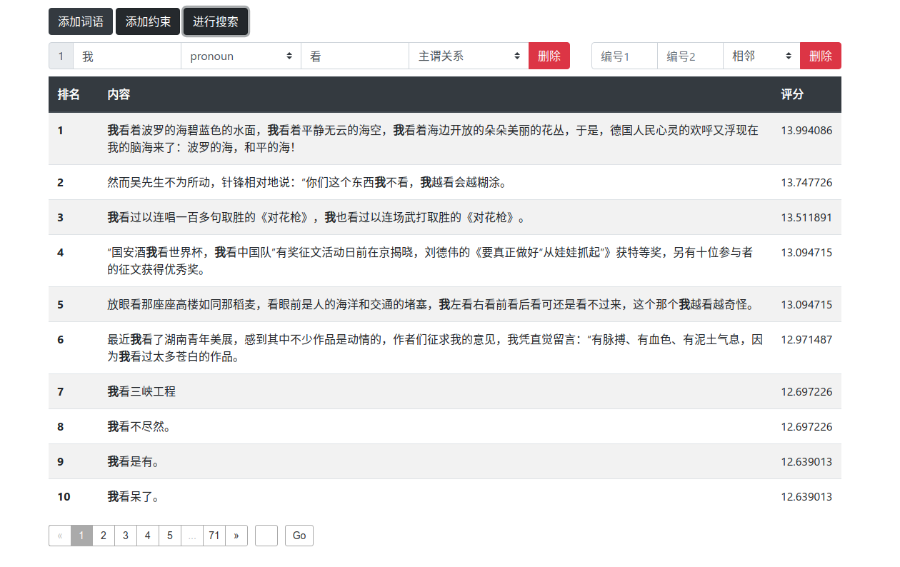
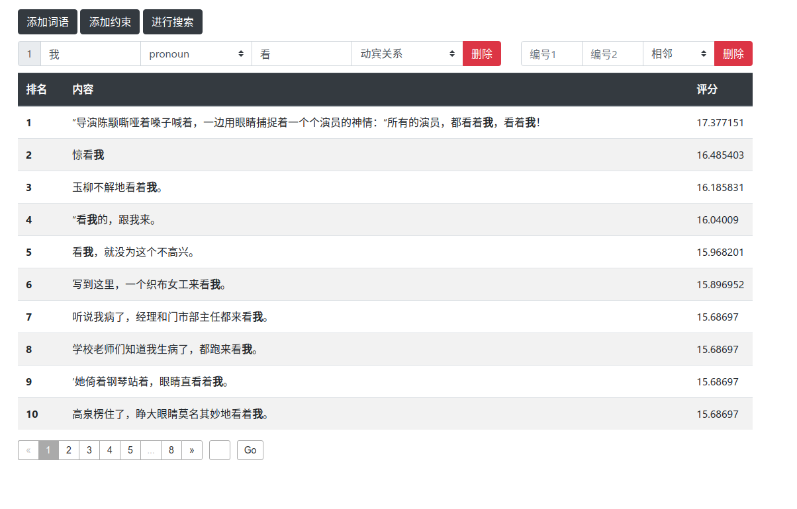

# 信息检索第五次作业报告

> 罗崚骁 计75
>
> 2017011364

## 摘要

本次作业基于第三次作业的检索系统，在词语及词性检索及位置约束的基础上，对文档进行了依存关系分析 (dependency parsing)，使得可以对被检索的词语指定其与其它词语的依存关系（主谓关系、动宾关系等）。

## 依存关系分析

使用了 [LTP](https://github.com/HIT-SCIR/ltp) 工具对文档进行依存关系分析。为了使新工具达到尽量好的分析效果，没有使用第三次作业中的分词结果，而是使用此工具对文档重新进行分词，然后再在此基础上进行词性标注及依存关系分析。

有关依存分析的一些介绍[见此](http://nlpprogress.com/english/dependency_parsing.html)。

## 功能实现

创建的索引仍然只有类型为 `text` 的 `content` 这一属性。此前为了支持词语及词性检索，通过恰当地设计 token filter，对于同一个词语，有如下三种元组用于建倒排索引：

- `(词语, 词性)`
- `(词语,)`
- `(词性,)`

为了保持这些功能，并增加新的依存关系检索功能，在保留上述这些元组的情况下，借助了[pattern replace](https://www.elastic.co/guide/en/elasticsearch/reference/current/analysis-pattern_replace-tokenfilter.html) 与 [multiplexer](https://www.elastic.co/guide/en/elasticsearch/reference/current/analysis-multiplexer-tokenfilter.html) 又增加了下面几种元组：

- `(词语, 词性, 依赖头, 依赖关系)`
- `(词语, 依赖头, 依赖关系)`
- `(词性, 依赖头, 依赖关系)`

此外，第三次作业中元组的存储通过下划线连接各部分，但其实分词后的文本中依然存在下划线。本次作业中使用了缩进字符 `\t` 来连接元组中的各部分，这样做的好处是缩进字符为空白字符，一定不存在于分词后的文本中，也就没有了歧义。

具体配置见 `word/index-config.json`。

搜索时，只需将用户输入拼接即可，基本与此前的实现类似。

## 操作界面

在保持原有功能输入的基础上，网页界面中增加了可以输入依存关系中依赖头和选择依赖关系的部分：

## 结果展示

下面的例子中搜索 `我`  这个代词，并希望其与 `看` 字形成 `主谓关系`：

可以看出，结果中的句子都存在 `我` 与 `看` 构成主谓关系的成分。在第二个与第五个结果中，有`我不看` 和 `我越看` 这样的情况，虽然这两个词没有相邻，但也构成诸位关系，也被检索了出来。

而当关系设为 `动宾关系` 时：

可见检索结果中都存在 `我` 与 `看` 构成动宾关系的成分，如 `看我`，`看着我` 等。

